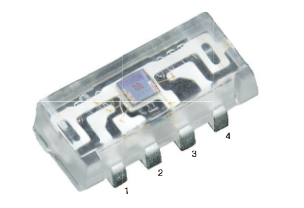
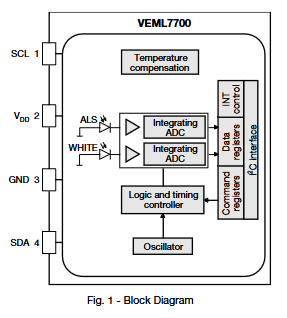
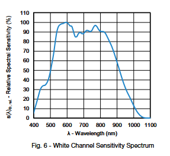
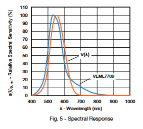
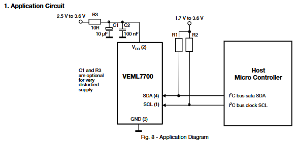
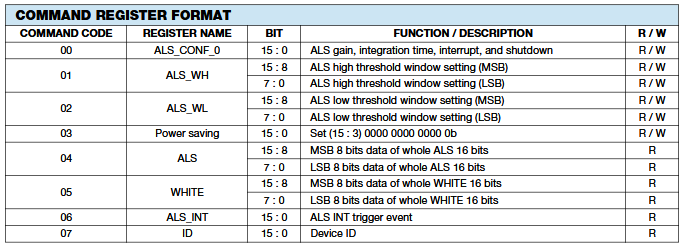
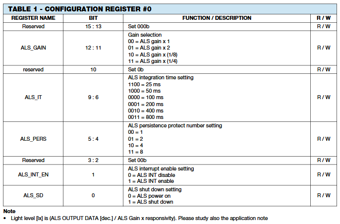
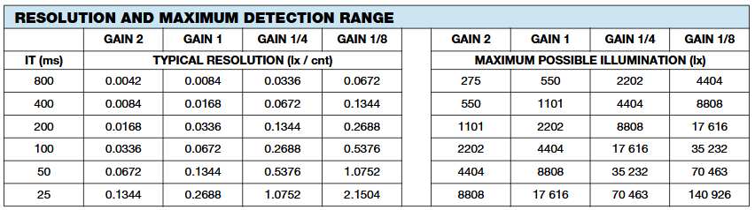

# VEML7700-ESP-IDF-Library
A brief C library for the VEML7700 sensor that utilizes the software I2C tools provided by the ESP IDF. Developed and tested with an ESP32 S3 on ESP-IDF v5.3.2.

This library is not complete and has limited functionality as of Dec/8th/2024.

  

This IC has 2 built in light sensors with different responses to wavelengths. These can be accessed separately depending on the application.

  
  
  

# How to use
The provided source and header files are to be used with the default ESP IDF software i2c driver files. Include these files in your project.

Reference the example main.c file for a quick setup and simple use.

# Useful Information

## Setting up your VEML7700 IC
Read and re-read the datasheet!
https://www.vishay.com/docs/84286/veml7700.pdf
https://www.vishay.com/docs/84323/designingveml7700.pdf

Dont forget your i2c pull up resistors

  

## Command Registers

  

## Config Register Details

  

## Determining Resolution
Based on your chosen gain and integration time, you will get a different constant. The default config is set to the highest range and most course resolution of 2.1504lux/unit. Use the table below to adjust this for your application.

  

